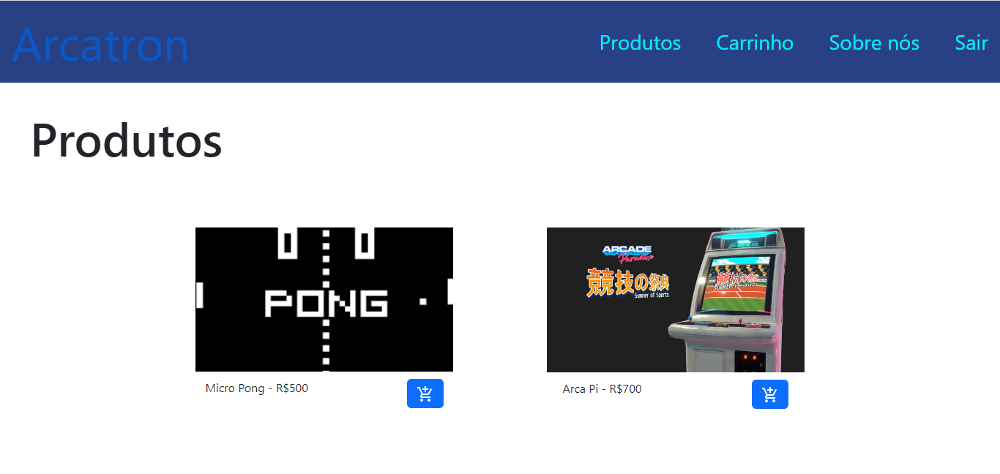
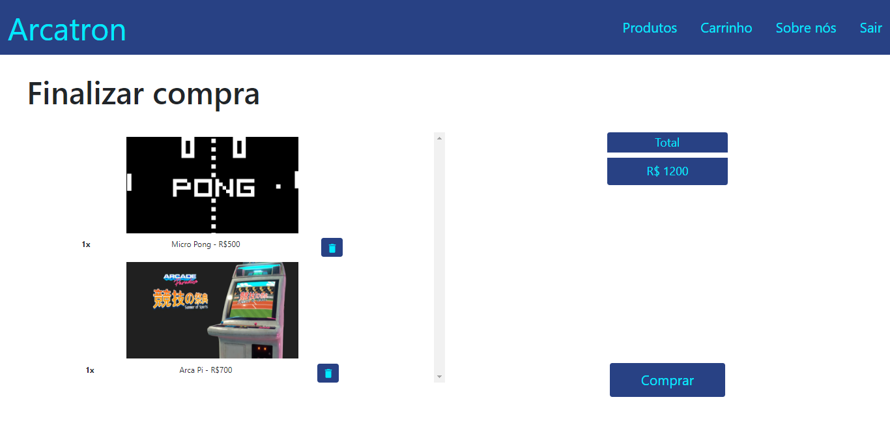
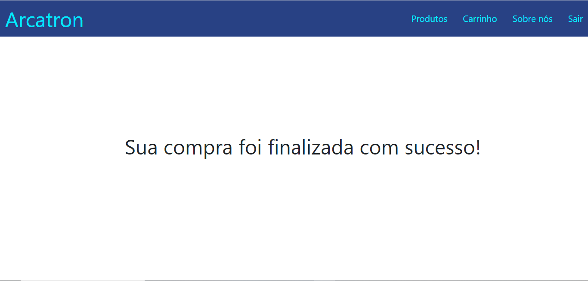

# `Front-End`

## Aplicação do Front End

<br/>

# 🏁 Início Rápido

### Clonar este repositório:

```bash
git clone [this repository]
```

### Acessar diretório:

```bash
cd frontEnd/front-loja-online
```

### Instalar react-scripts:

```bash
 npm install react-scripts --save
```

### Iniciar modo de desenvolvimento:

```bash
npm start
```

<br/>

# 💻 Como Usar

### O ambiente de desenvolvimento será aberto em `http://localhost:3000/`

<br/>

#### Na tela de login o usuário pode escolher entre fazer o login com email e senha, ou caso não possua conta que realize um cadastro.


<br/>

#### Caso o usuário opte pela opção de cadastro será redirecionado para uma tela que deve inserir os dados solicitados para criar uma nova conta.


<br/>

#### Após realizar o login o usuário será redirecionado para uma página de produtos. Na página de produtos ele poderá navegar entre eles e adicioná-los ao carrinho


<br/>

#### Na página de carrinho o usuário poderá ver todos os itens do carrinho, ver o valor total da compra e a remover os itens conforme desejar


<br/>

#### Ao clicar em `Comprar` o usuário conclui a compra atual com os itens presentes no carrinho e limpa os itens nele


<br/>

#### Por fim o usuário pode clicar em `Sair` para efetuar o logout da conta