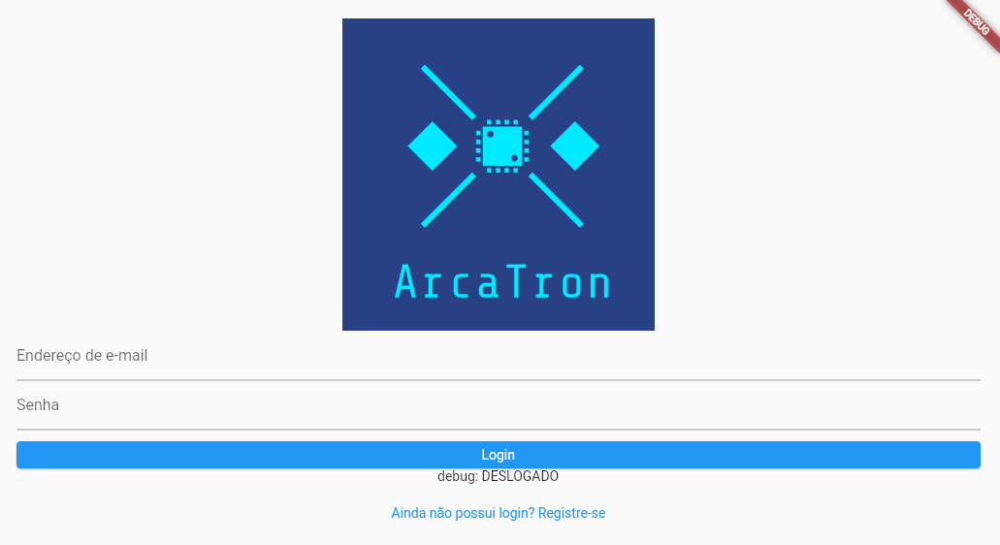
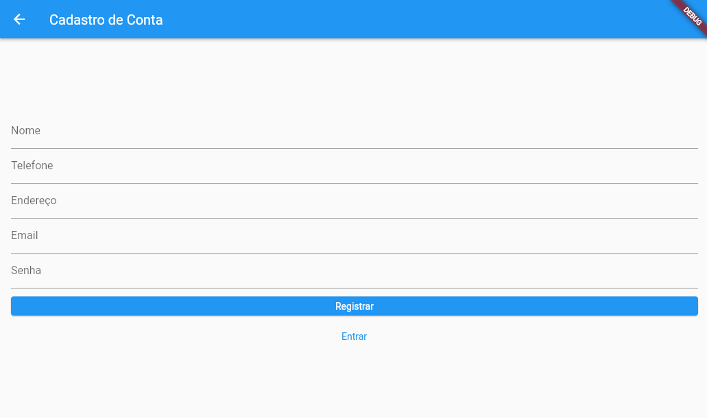
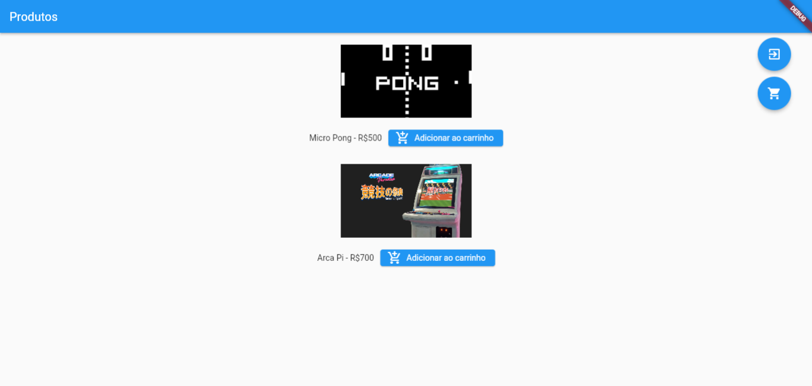
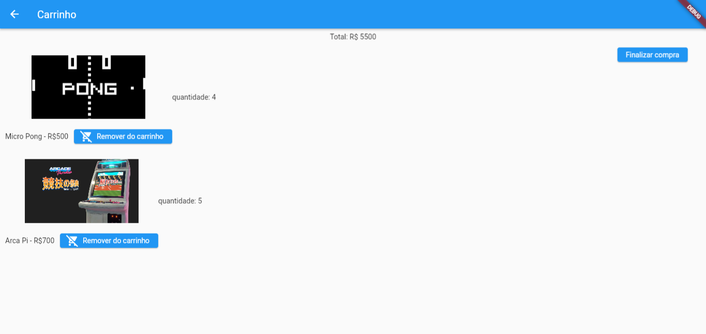

# `Front-End`

## Aplicação do Front End

<br/>

# 🏁 Início Rápido

### Clonar este repositório:

```bash
git clone [this repository]
```

### Acessar diretório:

```bash
cd frontEnd/front_loja_online_flutter
```

### Iniciar:

```bash
flutter run
```

<br/>

# 💻 Como Usar
#### Na tela de login o usuário pode escolher entre fazer o login com email e senha, ou caso não possua conta que realize um cadastro.



<br/>

#### Caso o usuário opte pela opção de cadastro será redirecionado para uma tela que deve inserir os dados solicitados para criar uma nova conta.


<br/>

#### Após o Login o usuário é apresentado à tela de produtos, onde ele pode vizualizá-los e adicioná-los ao carrinho.


<br/>

#### Ao clicar no ícone de carrinho o usuário vizualiza os itens que ele adicionou e é dado a opção de retirar os itens ou encerrar a compra.
